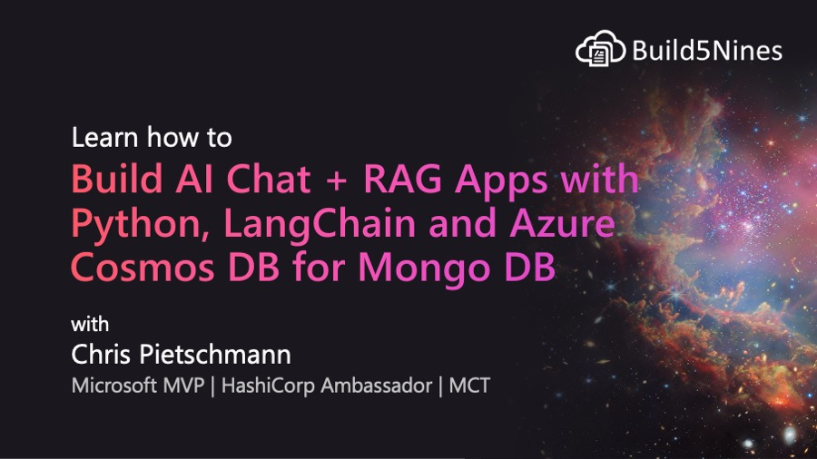

# Build AI Chat + RAG Apps with Python and Azure Cosmos DB for MongoDB (vCore)

This repository contains hands-on lab guide support files for the "[Build AI Chat + RAG Apps with Python, LangChain and Azure Cosmos DB for MongoDB](https://members.build5nines.com/courses/build-ai-chat-rag-apps-with-python-langchain-and-azure-cosmos-db-for-mongodb/)" course that is part of the Build5Nines Membership.

## Empower Your Applications with AI-Driven Chat and Vector Search

🚀 Enroll in this course so you can learn how to build, deploy, and scale intelligent chat applications powered by Azure OpenAI and Azure Cosmos DB for MongoDB. This project guides you through developing AI chatbots and Retrieval-Augmented Generation (RAG) systems that provide accurate, context-aware answers using enterprise-grade tools.

[Enroll in the Build5Nines Membership Today!](https://members.build5nines.com)
